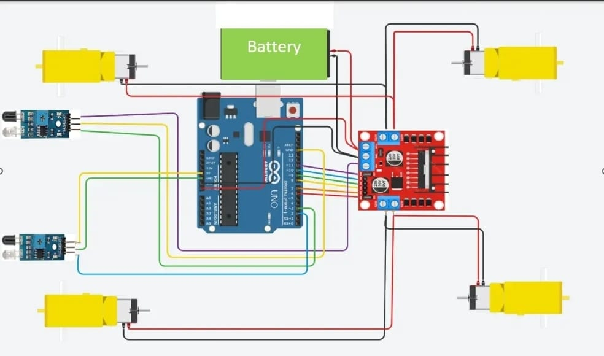
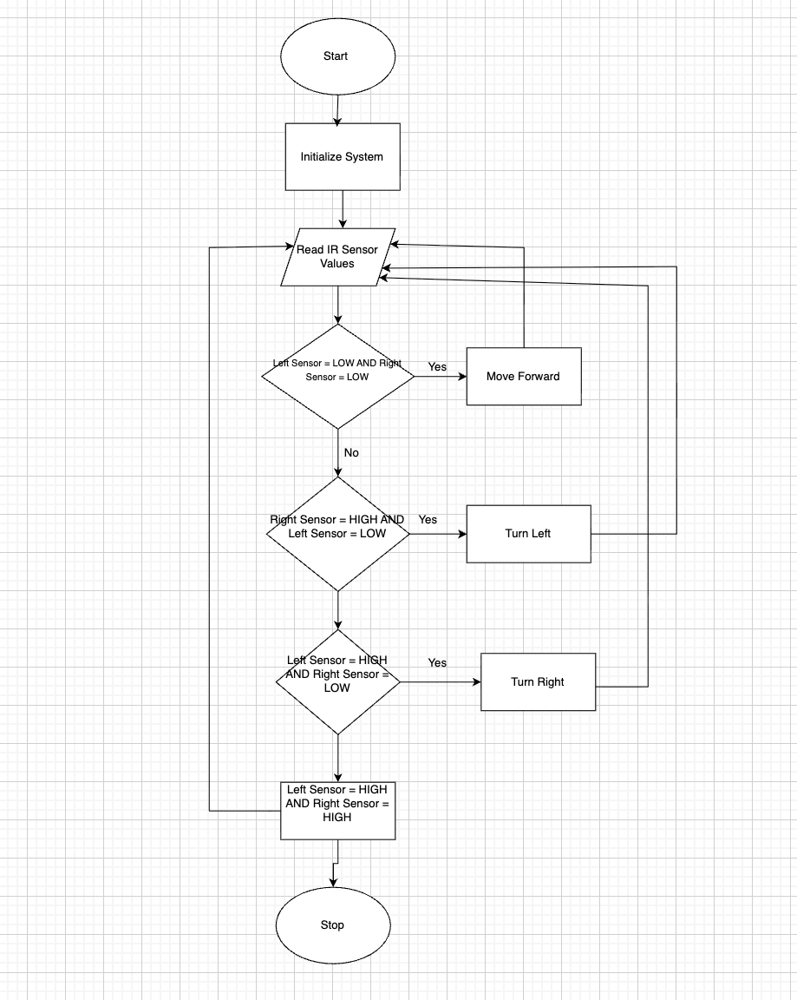

# Line Follower Robot (Arduino)

This project demonstrates an autonomous robot that follows a predefined path using IR sensors and Arduino-based motor control.

## Author
**Habiba Abouraya**

## Institution
Arab Academy for Science and Technology  
Computer Science – Embedded Systems

---

## Features
- Line detection using IR sensors
- Autonomous navigation
- Motor control using L298N driver
- Low-cost and efficient design

---

## Components Used
- Arduino Uno
- L298N Motor Driver
- DC Motors (x2)
- IR Sensors (x2)
- Battery Pack
- Chassis & Wires

---

## Circuit Diagram

---

## Robot Design

---

## Flowchart

---

## Cost Analysis
Total Cost: **1003 EGP**

See full details here:  
[Cost Analysis](docs/cost-analysis.md)

---

## How It Works
1. Read IR sensor values
2. Detect line position
3. Adjust motors:
   - Forward
   - Turn left
   - Turn right
   - Stop

---

## How to Run
1. Open Arduino IDE
2. Upload `LineFollowerProject.ino`
3. Connect components as shown
4. Power the robot

---

## 📌 Future Improvements
- Add PID control
- Increase speed accuracy
- Add obstacle detection

---
